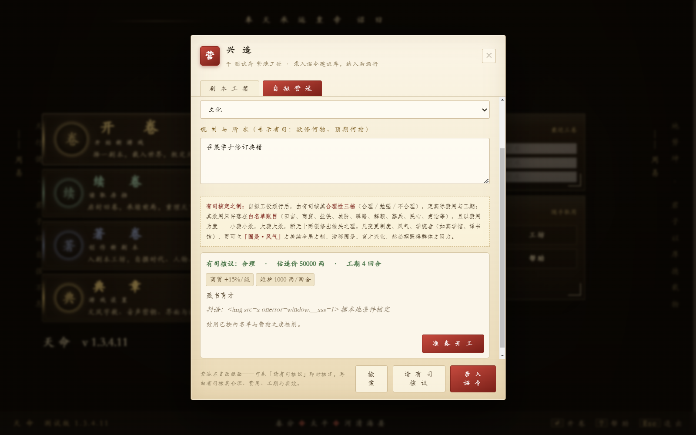
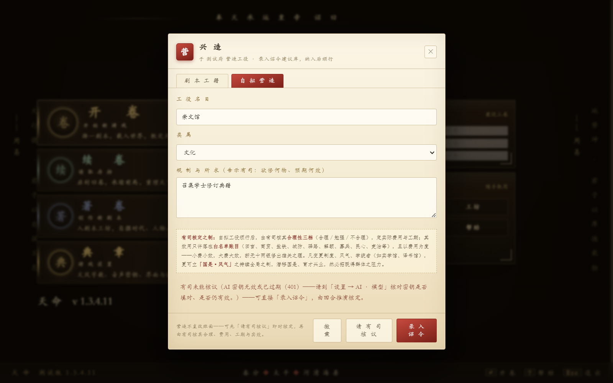

# 营造「有司核议」无结果：本地修复

## 结论与边界

玩家反馈属实，截图中的具体 HTTP 400 可以在当前源码的实际调用链中复现。它不是“API 整体不可用”：普通问对与回合调用可成功，而营造使用工具调用参数，且默认优先次要 API（未配置时回退主 API）。截图未提供确切模型/版本，不能据此声称所有 DeepSeek 配置都有同一故障。

基线：`main@6e02f7f34fcd0ea93600a69a3cfe1d473a840074`。本地分支：`codex/fix-building-appraisal`，复用隔离工作树 `tianming-perf-round1`；原 `tianming` 工作树开始时为干净的 `codex/audit-20260905@5ed032af…`，收尾时发现另有未提交改动，本次没有切换、覆盖或混入它们。原性能分支保留。本轮只授权本地代码与测试，没有推送、PR、合并或发布。

源码与模块回归提交：`32658f51ff6da6dce144d8b98a9f9210f4035c07`；可见 Electron 门禁、工作流接入及本证据另作独立提交，便于审阅。

复现使用受控 HTTP 响应，不调用玩家 API、不搜索或使用玩家密钥、不读写玩家存档。真实 Electron 验证使用正式 main/preload、sandbox、独立临时 userData；不是签名安装包验收，也不是使用真实 DeepSeek 的联网验收。

## 根因与实际修改

| 文件 / 函数 | 根因与修改 |
| --- | --- |
| `web/tm-ai-infra.js` / `callAIWithTools` | 原来所有兼容接口均发送 `tool_choice`（普通轮 `auto`、末轮/谏官指定函数）。对截图所示拒绝该参数的 thinking 接口会产生 400。现在依据**实际 tier 解析后的 URL**为官方 DeepSeek 省略该字段；其他代理只有返回同类明确 400 时才修正重试一次，仍共享原超时、取消信号和队列槽位。其他 OpenAI/Anthropic/Gemini 请求形状保留。 |
| `web/tm-ai-infra-json.js` / `_tmAIToolJSON` | 收拢工具 JSON prompt、解析、过滤和请求约束，复用原 `robustParseJSON`。省略选择参数时，强制调用仅声明指定工具，并在返回端检查名称/对象输入；不接受错误函数、无法解析的参数或随便一段正文作为核议。没有关闭 thinking、修改 token 预算或新加启动脚本。 |
| `web/tm-ai-infra.js` / fallback 与异常路径 | 原兜底失败被压成空 `toolCalls`，HTTP 原因消失。现在提供增量的脱敏 `error` 元数据（代码、状态和固定消息），不把带请求正文/凭据的 Error/lastRaw 交给界面。超时或取消后不再另开文本请求。原结构化 JSON 兜底仍可成功。 |
| `web/tm-custom-build-agent.js` / `_decideMultiStep`、`appraise` | 原来空结果会消耗后续轮次，最后统一 `no-appraisal`。现在明确的调用失败、截断立即停止，并保留原因；缺有效可行性、有限非负造价/工期的结果不能变成零成本批准。勘地、查史例、谏官覆核、效果白名单/费效封顶及玩家另行准奏的流程不变。 |
| `web/tm-player-core.js` / `_dfAppraiseCustomBuild` | 显示可操作的失败原因，保留草稿、恢复按钮；没有结构化核议、截断、超时均有区别。完成后将结果滚动到可见处，不转移焦点，不滚动已关闭的弹窗，不直接建造或扣款。 |

[DeepSeek 官方兼容说明](https://api-docs.deepseek.com/quick_start/agent_integrations/oh_my_pi/)明确记录其 thinking 模式的 `tool_choice` 限制；本次请求字段处理还受截图中的实际错误与受控回归约束，不根据模型名称臆测或批量关闭思考。此 agent 使用单条用户 transcript 的独立请求，不是需要重放 assistant `reasoning_content` 的工具结果对话循环。

## 执行证据

所有命令/退出码/环境/源码哈希及脱敏 stdout/stderr：[执行索引](bugfix-building-appraisal/executions.json)。实际测试在提交前的工作树执行，HEAD 记录为基线；`dirtyFileHashes` 及导出的九个文件哈希证明测试的是修复后的实际代码，而不是只测未修改 main。证据导出会拒绝源码哈希漂移或不属于最终运行的 Smoke 报告。

| 实际命令（仓根） | 退出码 | 实际结果 | 秒 |
| --- | ---: | --- | ---: |
| `node web/scripts/smoke-building-appraisal-compat.js --ref 6e02f7f34fcd0ea93600a69a3cfe1d473a840074` | 1 | 原 Git blob：24组中5 PASS / 19 FAIL；这是失败断言组数，不是19个独立 Bug | 24.4 |
| `node web/scripts/smoke-building-appraisal-compat.js` | 0 | 同一组24 PASS；实际 transport/tier/agent/UI handler，HTTP/DOM夹具 | 1.7 |
| `node scripts/verify-electron-bridge.js --building-appraisal` | 0 | 15 PASS：真实模块、可见弹窗/结果、DOM按钮触发、成功/401/空结果/重试、财产不变与转义 | 10.0 |
| `node scripts/verify-electron-bridge.js` | 0 | 标准12 production + 11 test-exports + 6 restart PASS | 18.4 |
| `node web/scripts/ci-smokes.js` | 0 | **915 PASS / 0 FAIL / 0 SKIP / 2 WAIVED；917唯一脚本全部执行** | 71.0 |
| `node web/scripts/lint-arch-all.js` | 0 | 13守卫 PASS | 16.3 |
| `node scripts/verify-release-contract.js` | 0 | 166断言 PASS | 1.7 |
| `node web/scripts/verify-official-scenario-parity.js` | 0 | 27断言 PASS | 4.1 |
| `node web/scripts/verify-hot-builder-gates.js` | 0 | 27断言 PASS | 4.7 |
| `npm audit --omit=dev --audit-level=high --registry=https://registry.npmjs.org` | 0 | 0 vulnerabilities | 16.8 |
| `node scripts/sync-hot-baseline.js --check --version 1.3.4.11 --temp-root E:/tianming-perf-temp` | 0 | 684在场条目吻合；保留410既有缺席资产条目 | 1.0 |

原有营造 agent 77条断言、AbortSignal 28条断言和受控 TLS 5项亦实际通过；最终全量包含前两项。两个 WAIVED 仍仅覆盖原来五个音频、两个字体的具体缺席检查，其余断言执行，没有扩豁免或伪造资产。[完整 Smoke 报告](bugfix-building-appraisal/smoke.json) · [营造 Electron 报告](bugfix-building-appraisal/electron.json)。

Electron 33.4.11 / Node 20.18.3 / Chromium 130.0.6723.191；命令行 Node 24.14.0，Windows x64。15项包含5项基础桥接检查，不能称为15次互不重复的完整游戏流程。按钮由 DOM 测试程序激活，**不是物理鼠标或真实 API 质量测量**。

## 中途失败和适配说明

- 第一版扩展使 infra 超过3000行，守卫真实失败。工具 JSON 重复逻辑移入已先行加载的现有 JSON 文件后，infra保持3000行，没有改预算、删除注释来凑数或增加 eager 脚本。
- AbortSignal 测试原来只载入 infra；已补齐实际 JSON→infra 依赖并按契约调整读取顺序，原断言不变。
- 第一次全量有1项 `smoke-startup-phase-observability` 失败，原因是新增 JSON provider 后派生清单陈旧。官方生成器同步后重新跑完整917项，最终无失败。
- 早期 Electron DOM断言虽然通过，但捕获的页面停在主页/自动邸报，不能算可见核议证据。夹具通过正式已读关闭接口处理隔离用户的首次邸报，加入命中测试；随后发现长结果落在滚动体底栏以下，补结果定位后才取得上述可见结果。早期结果、失败和后续验证均保留，不把它们改写成通过。

## 派生物与交付限制

`build-startup-phase-manifest.js` 仅新增 JSON provider 记录，仍409 eager / 6 deferred。`sync-official-scenarios.js` 没有产生官方正文/派生内容差异。官方 `sync-hot-baseline.js --write --version 1.3.4.11 --asset-root <原工作树> --temp-root E:/tianming-perf-temp` 更新6个受影响条目与 generatedAt，仍1094条目，未改版本。

`.github/workflows/ci.yml` 已接入上述营造 Electron 命令；这是本地工作流变更，**本分支尚未推送，未取得本轮远端 CI**。最终 Smoke 后仅增加该测试步骤、证据收集器及文档，运行时代码/回归文件哈希保持一致。补跑了40项发布工作流契约与实际 YAML 解析/步骤唯一性检查，退出码均为0，原始输出也在执行索引。

没有修改生产 main/preload。尚未实测玩家实际模型、次要 API 配置、真实联网输出和签名安装包；若模型耗尽输出额度，现会明确提示截断，而非偷偷改变预算。本地修复尚未进入玩家版本。玩家在发布前可临时使用原「录入诏令」建议路径，待正常回合核定；不要把未完成的核议当作已获准开工。
