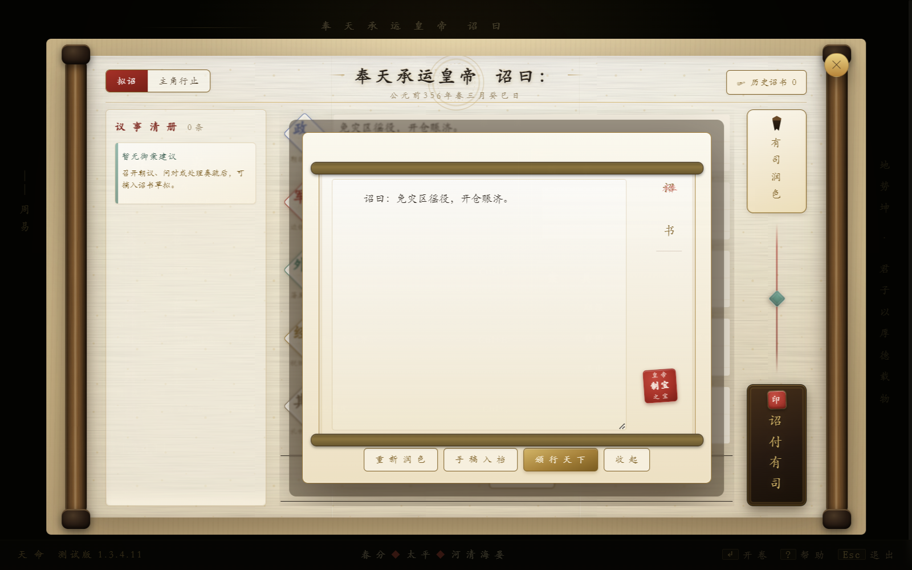
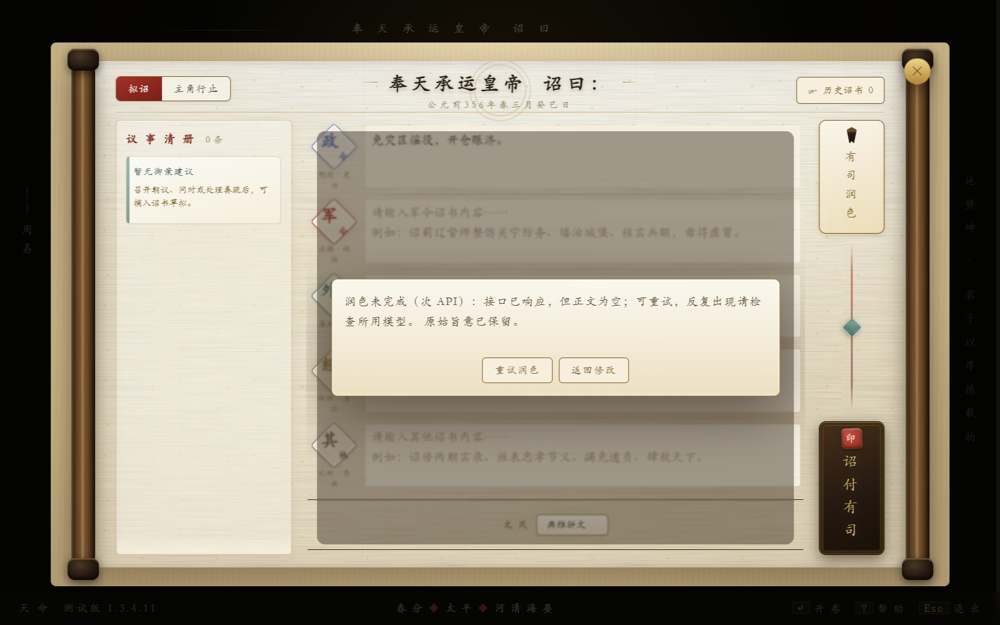

# 玩家反馈：诏书润色未返回内容

## 结论与边界

已修复可复现的润色响应处理缺口；没有以这张截图推断玩家具体使用的模型、密钥状态或 HTTP 错误。截图只对应 `_polishEdicts` 原先的 falsy-result 分支。本次没有调用玩家 API，也没有把受控 HTTP 回归当成真实供应商请求。

- 实际修复起点：`2aba473385c9346bfc9905ee5019520f84a23c80`，分支 `codex/fix-edict-polish`。
- 实时核验的 `origin/main`：`6e02f7f34fcd0ea93600a69a3cfe1d473a840074`。
- 起点包含前一次营造核议的两个未推送提交 `32658f51`、`2aba4733`，本轮在其后独立提交，未把它们宣称为本次新增修复。
- 原目录仍为 `codex/audit-20260905@5ed032af`；既有 272 个脏改/未跟踪文件均逐字节保留。本轮源码仅改于隔离工作树。
- 本地实现与测试；未推送、未合并、未发布、未改版本。

## 根因和实际修改

| 文件 / 函数 | 已核实问题与修复 |
|---|---|
| `web/tm-hongyan-edict-ui.js` / `_polishEdicts` | 原请求基数固定 2000 token（还会被既有配置缩放），不区分正文为空、思考未完成和输出截断。现在请求完整正文契约，仅 `length/max_tokens` 截断允许一次扩大预算重试；单次上限为 8000 与既有模型输出上限两者较小值，不改变提示正文、模型或思考模式。HTTP/空响应/拒绝不触发这种额外重试。既有传输层另保留一次网络重试。 |
| 同上 / `_edictPolishFailure` | 原 UI 仅显示“未返回内容”，错误原文还可能直接显示供应商回显。现在区分空正文、仅思考、截断、拒绝、格式、HTTP 等；文本节点显示经过分类的提示，不展示原始响应/密钥/思考正文；提供真正可点击的重试与返回修改。 |
| 同上 / `_polishEdicts`, `_hidePolishedEdict` | 新增同面板单请求、AbortController、现有世界 lease 和输入快照核验；收起后不重新弹出、换局/新请求的迟到结果不覆盖当前稿件，也不解除另一个请求的按钮锁。草稿在失败时不清空，不自动颁行。仅配次 API 也能请求；没有任一可用密钥时保留原本离线合并。 |
| `web/tm-ai-infra-json.js` / `_tmAITextResult` | opt-in 解析完整文本和受支持的 text/output_text 分块；不将 reasoning/thinking/refusal 内容当诏书。错误仅带受控 code、已发送上限和 reasoningOnly 布尔，不带响应正文。 |
| `web/tm-ai-infra.js` / `callAI`, `callAIMessages` | 共用返回处理，未开启 requireText 的旧调用保持原返回语义；仅 `callAI` 按调用者可选 maxOutputTokens 约束缩放后的实际额度。SC1、工具调用、存档和回合原子性未重写。 |

供应商契约参考：[DeepSeek 思考模式](https://api-docs.deepseek.com/guides/thinking_mode/)明确区分 `reasoning_content` 与最终 `content`；[Chat Completions](https://api-docs.deepseek.com/api/create-chat-completion/)描述 `finish_reason=length` 的截断含义。这里是兼容性依据，不证明该玩家现场正是这一原因。

## 实际回归

使用同一 `smoke-edict-polish-results.js --ref <起点>` 从 Git blob 加载真实起点实现；不替换为旧夹具或成功实现。25 个行为组：起点 **8 PASS / 17 FAIL**；修复后 **25 PASS / 0 FAIL**。失败组含重叠验收不变量，不等于 17 个独立玩家 Bug。

命令均在隔离仓根执行；原始 stdout/stderr、退出码、平台、Node、当时 HEAD/dirty hashes 已导出到 [executions.json](bugfix-edict-polish/executions.json)。表内耗时来自对应 `run.json`，不是手工估算。

| 命令 | 退出码 | 实际结果 | 秒 |
|---|---:|---|---:|
| `node web/scripts/smoke-edict-polish-results.js --ref 2aba473385c9346bfc9905ee5019520f84a23c80` | 1 | 8 PASS / 17 FAIL（预期基线缺陷） | 33.1 |
| `node web/scripts/smoke-edict-polish-results.js` | 0 | 25 PASS | 1.9 |
| `node scripts/verify-electron-bridge.js --edict-polish` | 0 | 15 PASS（5 基础桥接 + 10 本功能检查） | 17.7 |
| `node scripts/verify-electron-bridge.js` | 0 | 29 PASS（production/test-exports/restart） | 33.0 |
| `node web/scripts/ci-smokes.js` | 0 | 916 PASS / 0 FAIL / 0 SKIP / 2 WAIVED；918 全部执行 | 107.4 |
| `node web/scripts/lint-arch-all.js` | 0 | 13 守卫通过 | 26.7 |
| `node scripts/verify-release-contract.js` | 0 | 166 断言通过 | 1.8 |
| `node web/scripts/verify-official-scenario-parity.js` | 0 | 27 断言通过 | 3.0 |
| `node web/scripts/verify-hot-builder-gates.js` | 0 | 27 合成夹具断言通过；未构建发布游戏包 | 5.1 |
| `npm audit --omit=dev --audit-level=high --registry=https://registry.npmjs.org` | 0 | 0 vulnerabilities | 7.5 |

另外独立运行旧润色 scope 16、诏书整体颁行 16、营造核议 24、Abort 清理 28 项均通过；完整日志同上。全量仅保留原来两个脚本内的 **7 项具体缺席资产检查**豁免，未扩大白名单。[全量报告](bugfix-edict-polish/smoke.json)绑定运行 `a13ea2a2-0351-4c55-acc3-bafd6938c75f`。

Electron 为本机 Windows 未打包 **33.4.11**，真正加载正式 main/preload/renderer，临时 userData、阻断外网，HTTP 回包受控。[功能报告](bugfix-edict-polish/electron.json)。使用真实 DOM 按钮 `.click()`，不宣称物理鼠标或真实网络验收；没有 FPS、延迟或长局恢复承诺。

## 派生物和验证过程

- `index.html` 只同步 AI/诏书两组既有 family 查询戳，409 eager / 6 deferred 不变；`build-startup-phase-manifest.js` 登记两个新函数 provider。
- `sync-official-scenarios.js` 未改变官方正文或版本。官方 `sync-hot-baseline.js --write --version 1.3.4.11 --asset-root C:/Users/37814/Desktop/tianming --temp-root E:/tianming-perf-temp` 保留 **1094** 项，仅更新 index、startup 清单和三份生产 JS 的 hash/size，未新增删除资产。
- 首次在无资产工作树直接生成曾产出 684 项；检查发现后立即用上面的正式 asset-root 流程重建，最终没有采纳丢失的 410 项资产清单，也未手写哈希。
- 首次 Electron 截图拍在 `.22s` 入场动画起点，虽然外层遮罩命中却不足以证明卡片可见。改为等待有限动画完成，并验证具体卡片 opacity、位置与按钮命中；最后将失败操作放在卡片内，避免被背景伪元素遮挡。最终截图已实际查看。
- 早期脚本检索/补丁锚点和临时统计命令曾报错，未作为验证通过依据；没有降低断言。证据中较早绿色运行不代替最后完整回归。
- `.github/workflows/ci.yml` 已接入这项真实 Electron 功能检查，但本轮尚未推送，**没有远端 CI 结果**。
- 执行报告的 HEAD 为修复起点加 dirty 状态；导出器逐一核验 11 个最终源码/测试/配置哈希与最终全量运行一致。其后只增加报告、导出脚本和脱敏证据，不用文档提交 SHA 冒充另一轮实测。

尚待玩家补充主/次模型名称或控制台错误，才能锁定其现场到底属于哪一种情况。当前不建议让玩家关闭思考模式、提供密钥或丢弃草稿。没有进行安装包、OTA 或生产服务操作。
